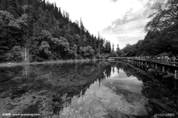

# Grayscale coloring

Course project of [Machine Learning for Finance](https://github.com/PHBS/2018.M1.MLF) at [PHBS](http://english.phbs.pku.edu.cn/). This project aims to colorize gray pictures. The
repository is where we develop algorithms. We welcome contributions if you are interested in our
project. For example, you can:

* [Submit bugs or issues](https://github.com/devon-ge/PHBS_MLF_2018/issues) to improve the performance of our model.
* [File pull requests](https://github.com/devon-ge/PHBS_MLF_2018/pulls) if you have better ideas.

## Team Members

* [Ge Desheng](https://github.com/devon-ge), student ID: 1701213756
* [Wang Yumeng](https://github.com/yumengwang123), student ID: 1701213112
* [WuGan](https://github.com/SuperWGAaron), student ID: 1701212974
* [Zhang Mingyu](https://github.com/myzhangcn), student ID: 1701213151

## Motivation

With the popularity of machine learning, a variety of applications are hoping to simplify
both our lives and jobs. The state-of-the-art machine learning methods in pattern recognition
enable humans to find the intrinsic relationship of things. For example, image recognition often
compares the gray scale of scanned picture with dataset for identificaiton. How to transform a
colorful picture to a gray one attracts attentions in algorithm research. This project, however,
intends to color a gray picture, i.e., regain the original image. We try to map gray scale to RGB
colors acorrding to gray scale distribution. In this way, colorful pictures contains more
information (such as RGB pixels), thus contributing to better recognition. Also, we can apply this
colorization model to repair old pictures.

## Data and preprocessing

The model receives gray pictures as input. To reduce the computation, we first lower the resolution
ration by compression. Obtain a natural landscape photo from the crawler program.

1. Convert all sample images into 256-px-width images by compression algorithm (Because of limited computation and standardization processing, follow-up algorithm can be used)

:)|Raw | Compressed (width=256 px)
---|---|---
Gray| | 
RGB| | 

2. Convert the color channel of the images from RGB to Lab (Lab contains grayscale and two color channels, which is convenience to process and train).

3. Images are divided into test sets and training sets according to a certain proportion.
## Neural metwork training

The architecture of the convolutional neural network consists of two major parts: 
1) The first part consists of a low-level feature extraction network, an intermediate feature extraction network, a fusion layer and a coloring network; 
2) the second part consists of a low-level feature extraction network and a global feature extraction network. 
Input the gray images and using the convolutional neural network to train the model, loss function is as followed.

[Compressed picture](./test/equation.gif)

The first half of the above function is the unsupervised network loss function, and the second half is the classification part loss. If Alpha=0, only the color loss is considered.

## Result
